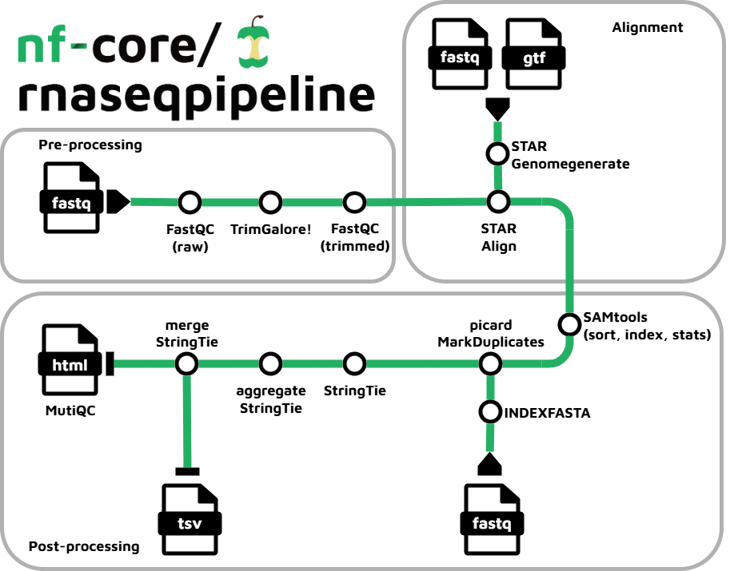

[](https://www.nextflow.io/)
[](https://github.com/nf-core/tools/releases/tag/3.3.2)

[](https://docs.conda.io/en/latest/)
[](https://www.docker.com/)
[](https://sylabs.io/docs/)


## Introduction

**nf-core/rnaseqpipeline** is a bioinformatics pipeline that performs RNA-Seq data analysis, from raw sequencing reads to gene expression quantification.




The pipeline ingests raw sequencing data in FASTQ format and processes it through several key steps, including quality control, read alignment, and transcript quantification. The final output includes gene expression TPMs and quality reports.

1. Read QC (FastQC)
1. Adapter and quality trimming (Trim Galore!)
1. Read QC (FastQC)
1. Alignment (STAR)
1. Sort and index alignments (SAMtools)
1. Duplicate read marking (picard MarkDuplicates)
1. Transcript assembly and quantification (StringTie)
1. Post-processing (aggregating and merging tables)
1. QC (MultiQC)

The pipeline is built using [Nextflow](https://www.nextflow.io/) and adheres to the [nf-core](https://nf-co.re/) community guidelines, ensuring high standards of reproducibility, scalability, and portability across different computing environments.


## Usage

> [!NOTE]
> If you are new to Nextflow and nf-core, please refer to [this page](https://nf-co.re/docs/usage/installation) on how to set up Nextflow. Make sure to [test your setup](https://nf-co.re/docs/usage/introduction#how-to-run-a-pipeline) with `-profile test_EB1` before running the workflow on actual data.
>
> ```nextflow run main.nf -profile test_EB1,<docker/apptainer/conda>```


First, prepare a samplesheet with your input data that looks as follows:

`samplesheet.csv`:

```csv
sample,fastq_1,fastq_2,condition,strandedness
SRR23195511,SRR23195511_1_sub500.fastq.gz,SRR23195511_2_sub500.fastq.gz,control,auto
SRR23195516,SRR23195516_1_sub500.fastq.gz,SRR23195516_2_sub500.fastq.gz,treatment,auto
```

Each row represents a FASTQ file (single-end) or a pair of FASTQ files (paired end).

| Column        | Description                                                                                   |
|---------------|-----------------------------------------------------------------------------------------------|
| sample        | Custom sample name                                                                            |
| fastq_1       | Full path to gzipped FASTQ file for Illumina short reads 1.                                   |
| fastq_2       | Full path to gzipped FASTQ file for Illumina short reads 2. Empty for single-end sequencing   |
| condition     | Custom condition name for downstream analysis                                                 |
| strandedness  | Sample strand-specificity. Must be one of `unstranded`, `forward`, `reverse` or `auto`.       |


Now, you can run the pipeline using:

<!-- TODO nf-core: update the following command to include all required parameters for a minimal example -->

```bash
nextflow run main.nf \
   -profile <docker/apptainer/conda> \
   --input samplesheet.csv \
   --outdir <OUTDIR>
```


> [!WARNING]
> Please provide pipeline parameters via the CLI or Nextflow `-params-file` option. Custom config files including those provided by the `-c` Nextflow option can be used to provide any configuration _**except for parameters**_; see [docs](https://nf-co.re/docs/usage/getting_started/configuration#custom-configuration-files).


## Pipeline parameters

The pipeline can be run with additional pipeline parameters via the CLI or the Nextflow `-params-file`.

- `--igenomes_reference`: specify reference genome for the sample. A list of possible options is provided in the `conf/igenomes.config` file. Default: `GRCm38`.

- `--fastqc_threads`: FastQC option. Specifies number of threads used for running FastQC. Default: `32`.

- `--trimgalore_min_length`: TrimGalore option. Reads that become shorter than a defined length are discarded. Default: `20`.

- `--trimgalore_min_qual`: TrimGalore option. Minimum Phred score for trimming low-quality ends from reads. Default: `20`.

- `--genetable_outfile`: Filename for the output gene table reporting TPMs over samples and genes. Default: `gene_table_TPM`


## Pipeline output

The pipeline outputs a gene count table reporting the TPMs per sample and gene. The file is located in the ```<OUTDIR>/gene_table``` directory. The pipeline also creates a comprehensive MultiQC report summarizing quality control over all pipeline steps. The report can be found in ```<OUTDIR>/multiqc```.


## Credits

nf-core/rnaseqpipeline was originally written by Mehdi Merbah and Nicolai Oswald as a replication of the nf-core/rnaseq pipeline.

We thank the nf-core community for their continuous support and contributions to the nf-core project and giving us a basis and the resources for developing this pipeline.


## Contributions and Support

If you would like to contribute to this pipeline, please see the [contributing guidelines](.github/CONTRIBUTING.md).

For further information or help, don't hesitate to get in touch on the [Slack `#rnaseqpipeline` channel](https://nfcore.slack.com/channels/rnaseqpipeline) (you can join with [this invite](https://nf-co.re/join/slack)).


## Citations

<!-- TODO nf-core: Add citation for pipeline after first release. Uncomment lines below and update Zenodo doi and badge at the top of this file. -->
<!-- If you use nf-core/rnaseqpipeline for your analysis, please cite it using the following doi: [10.5281/zenodo.XXXXXX](https://doi.org/10.5281/zenodo.XXXXXX) -->

<!-- TODO nf-core: Add bibliography of tools and data used in your pipeline -->

An extensive list of references for the tools used by the pipeline can be found in the [`CITATIONS.md`](CITATIONS.md) file.

You can cite the `nf-core` publication as follows:

> **The nf-core framework for community-curated bioinformatics pipelines.**
>
> Philip Ewels, Alexander Peltzer, Sven Fillinger, Harshil Patel, Johannes Alneberg, Andreas Wilm, Maxime Ulysse Garcia, Paolo Di Tommaso & Sven Nahnsen.
>
> _Nat Biotechnol._ 2020 Feb 13. doi: [10.1038/s41587-020-0439-x](https://dx.doi.org/10.1038/s41587-020-0439-x).
