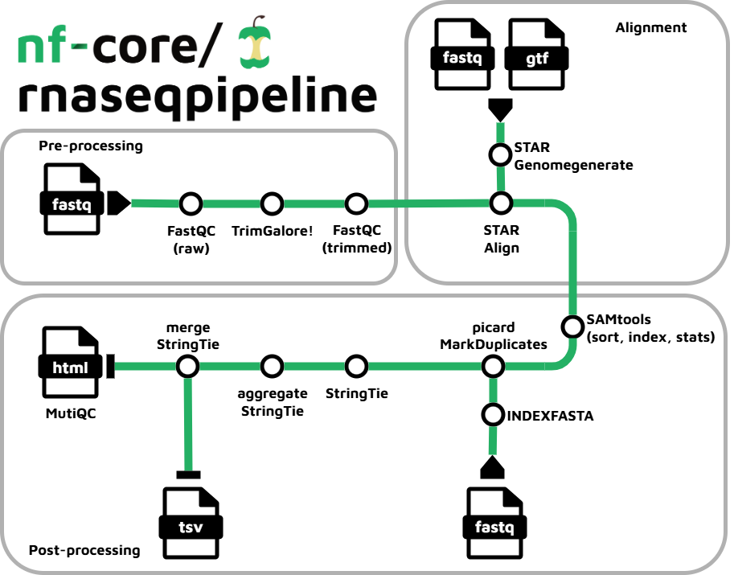

# Nextflow RNA-seq pipeline

An independent RNA-seq teaching and portfolio pipeline built with Nextflow DSL2 and selected nf-core modules.

> This repository is not an official nf-core pipeline and is not affiliated with the nf-core project. For production analyses, consider the community-maintained [nf-core/rnaseq](https://nf-co.re/rnaseq) pipeline.

## Workflow

The pipeline accepts single-end or paired-end gzipped FASTQ files and runs:

1. adapter and quality trimming with Trim Galore;
2. alignment with STAR, HISAT2, or Bowtie2;
3. coordinate sorting, indexing, and alignment statistics with SAMtools;
4. optional gene-level and feature-level exon counting with featureCounts;
5. optional DESeq2 analysis from a separately prepared count matrix; and
6. MultiQC reporting.

STAR and HISAT2 are splice-aware. Bowtie2 is included for comparison and is not recommended when splice-junction alignment is required.

### Original class-project workflow



This illustration is retained from the original class project as part of the repository's development history. It shows the initial STAR and StringTie design; the maintained workflow is the one described above and no longer runs the illustrated FastQC, Picard, or StringTie steps.

## Quick start

Requirements: Nextflow `>=24.10.5` and Docker, Apptainer, Singularity, or Conda.

```bash
nextflow run . -profile docker \
  --input assets/samplesheet.csv --outdir results \
  --fasta genome.fa --gtf genes.gtf --aligner star
```

Run the self-contained test profile with `nextflow run . -profile test,docker --outdir results-test`.

The input CSV columns are `sample`, `fastq_1`, `fastq_2`, `condition`, and `strandedness`. `condition` is retained as metadata; DESeq2 uses a separate metadata file. Repeated rows are supported by STAR. Bowtie2 and HISAT2 require lanes to be merged first and reject duplicate sample IDs.

## Optional analyses

Enable gene counts with `--run_featurecounts`. Add `--run_featurecounts_exon` for feature-level exon rows identified by gene ID and genomic coordinates. These tables are not presented as an alternative-splicing analysis.

DESeq2 is an independent sidecar, not a continuation of featureCounts. It requires `--deseq2_counts` and `--deseq2_samplesheet`.

See [usage](docs/usage.md), [outputs](docs/output.md), and [citations](CITATIONS.md).

## Scope and credits

The synthetic fixtures and `tests/smoke.sh` are regression data and checks, not biological benchmarks. A fresh installation still downloads plugins and software environments.

Developed by Mehdi Merbah and Nicolai Oswald at the University of Tübingen as a class project inspired by nf-core/rnaseq. Upstream provenance is recorded in `modules.json` and `modules/local/README.md`.

Released under the [MIT License](LICENSE).
